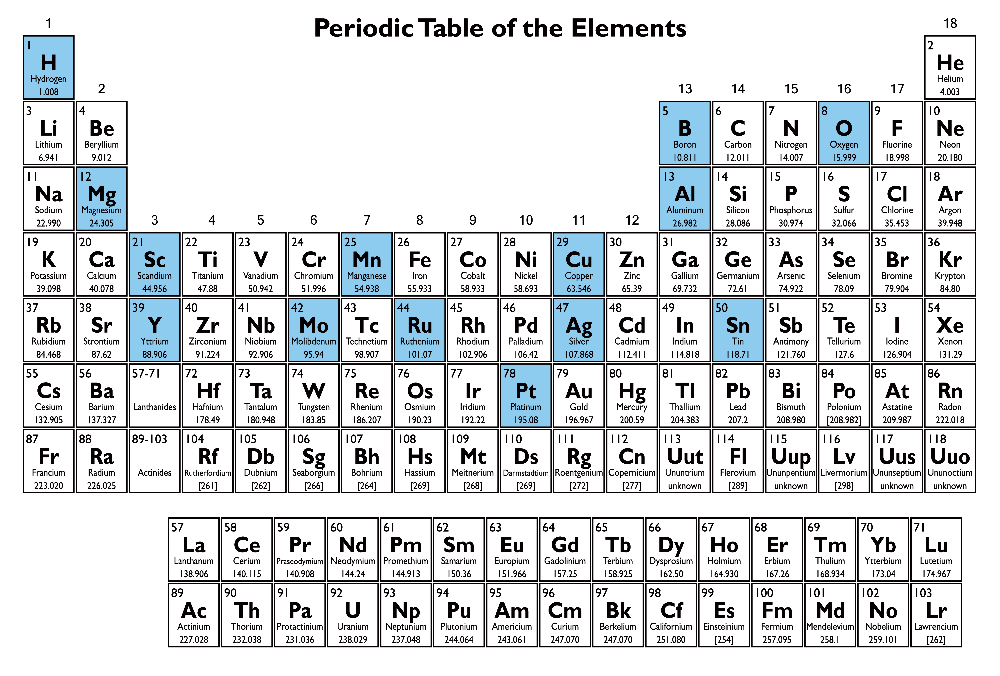

# Clusters Zen Garden

A minimal, machine‑friendly collection of small and medium-size metal clusters, each treated as a “stone” in a computational zen garden.

The periodic table below serves as a quiet guide to the elemental scope of this repository. Each highlighted atom represents a family of clusters included in this collection. Each arrangement is shaped by its own symmetry, energy, and form. Like stones in a garden, these elements are not selected for hierarchy but for harmony, each offering a different perspective on the architecture of matter.

  

## Data Sources

The cluster geometries provided in this repository are based on previously published peer-reviewed studies. Please cite the corresponding publications if you make use of this data in your own research:

For the Al and ScAl clusters:

1. **Guevara-Vela, J. M., Sauza-de la Vega, A., Gallegos, M., Martín Pendás, Á., & Rocha-Rinza, T.**  
   *Wave function analyses of scandium-doped aluminium clusters, AlₙSc (n = 1–24), and their CO₂ fixation abilities*  
   _Physical Chemistry Chemical Physics_, **25**(28), 18854–18865, 2023.  
   [DOI: 10.1039/d3cp01730c](https://doi.org/10.1039/d3cp01730c)

For the Pt15, Pt16, and Pt17 clusters: 

2. **Guevara-Vela, J. M., Rocha-Rinza, T., Rodríguez-Kessler, P. L., & Muñoz-Castro, A.**  
   *On the structure and electronic properties of Ptₙ clusters: new most stable structures for n = 16–17*  
   _Physical Chemistry Chemical Physics_, **25**(42), 28835–28840, 2023.  
   [DOI: 10.1039/d3cp04455f](https://doi.org/10.1039/d3cp04455f)

For the Pt18, Pt19, and Pt20 clusters:

3. **Guevara-Vela, J. M., Gallegos, M., Rocha-Rinza, T., Muñoz-Castro, Á., Rodríguez Kessler, P. L., & Martín Pendás, Á.**  
   *New global minimum conformers for the Pt₁₉ and Pt₂₀ clusters: low symmetric species featuring different active sites*  
   _Journal of Molecular Modeling_, **30**(9), 2024.  
   [DOI: 10.1007/s00894-024-06099-5](https://doi.org/10.1007/s00894-024-06099-5)

